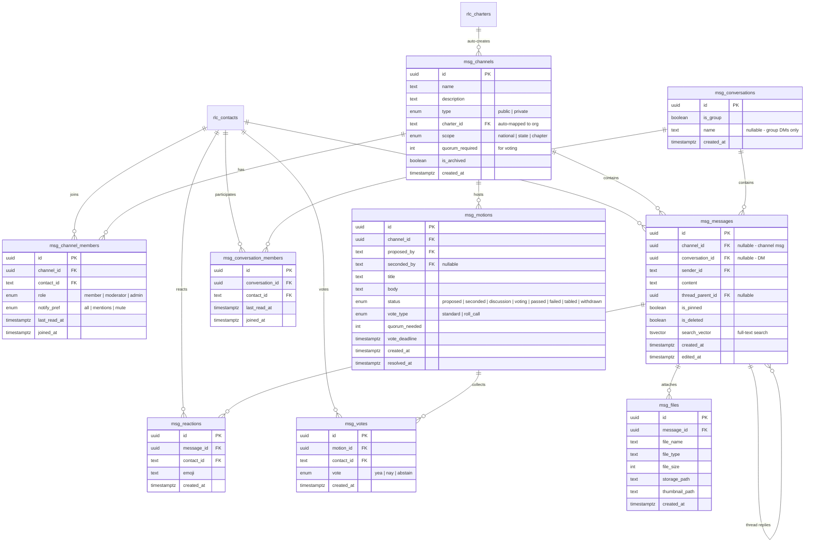
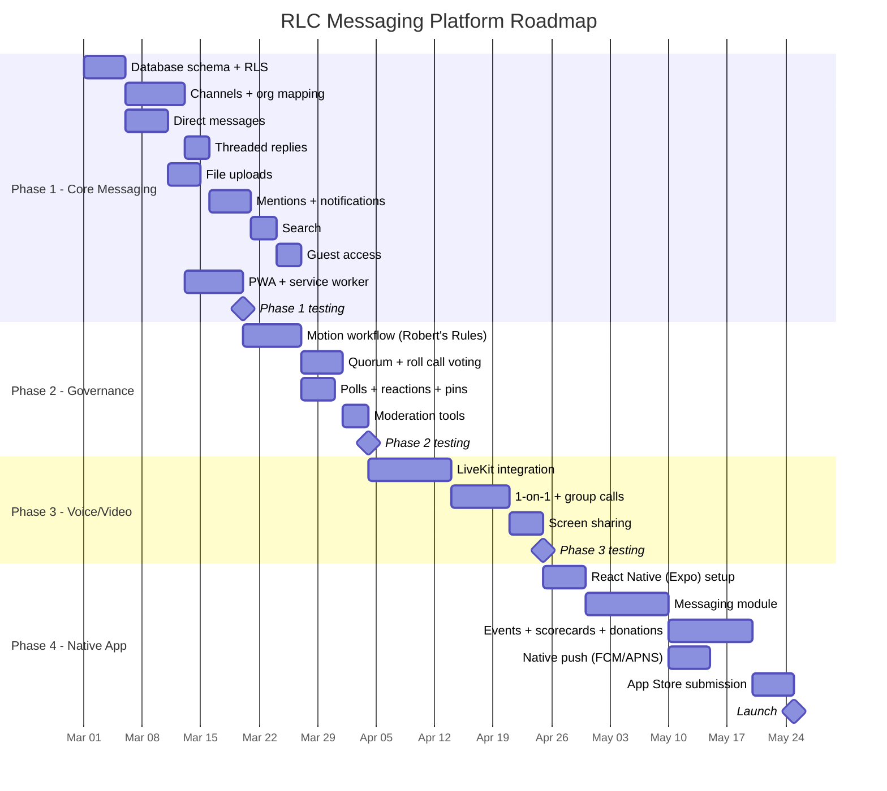
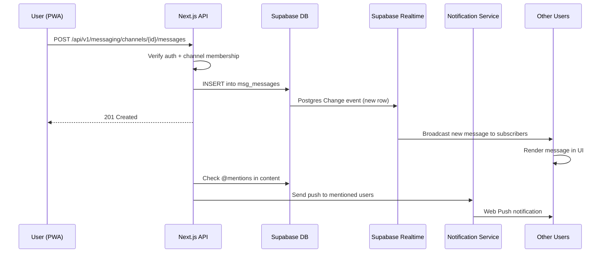
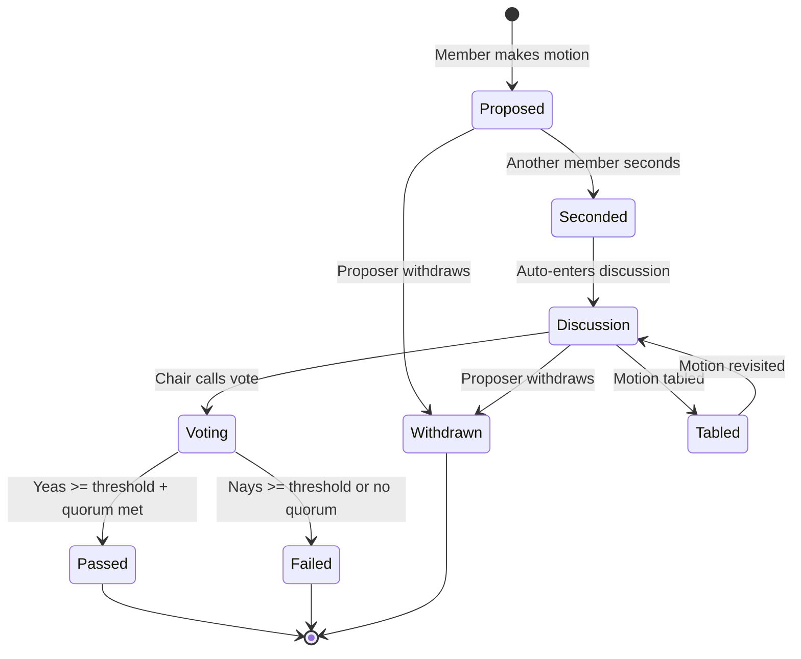

# PRD: RLC Membership Messaging Platform

> **Status:** Requirements Complete | **Created:** 2026-02-08 | **Owner:** Matt Nye

## Context

RLC currently has fragmented communication:
- **State Coordinators** use **Signal** for grassroots organizing and new chapter traction (groups, DMs, file sharing, voice/video)
- **National Board** uses **Slack** ($100/month) for between-meeting discussions, threaded channels, and votes
- **Goal**: Consolidate all messaging into the RLC membership platform, eliminate Slack cost, replace Signal dependency, and eventually ship a full RLC membership mobile app

### Why Not Signal?
Signal has **no public API** — it's intentionally closed to third-party integrations. Community tools (signal-cli, signal-bot) are unofficial, fragile, and potentially violate Signal's ToS. Signal cannot be embedded or integrated into our platform.

### Why Not Just Switch to Another External Tool?
Self-hosted alternatives (Rocket.Chat, Matrix/Element) are full-featured and cheap, but create the same "two apps" problem — members switch between the RLC website and a separate chat tool. This contradicts the consolidation goal and doesn't integrate with our org hierarchy.

---

## Constraints & Decisions

| Decision | Answer |
|----------|--------|
| Messaging features needed | Full: groups, DMs, file/photo sharing, voice/video calls |
| Board features needed | Channels + threads + Robert's Rules voting (motions, seconds, quorum) |
| Mobile strategy | PWA first, native app later |
| Encryption | Standard security (HTTPS + encrypted DB) — no E2E requirement |
| Expected users (6 months) | 100–500 |
| App scope | Full membership app (events, scorecards, donations, news) — messaging is one module |
| Voice/video | Deferred to Phase 3 — coordinators keep Signal for calls temporarily |
| Voice/video SDK | LiveKit (open-source WebRTC), hosted on Cloudflare (Railway fallback) |
| Voting model | Robert's Rules of Order (motions, seconds, quorum, roll call) |
| Guest access | Limited — certain channels (state organizing) open to prospective members |
| Message retention | Default to forever, with future option to archive (TBD) |
| Current stack | Next.js 15, Supabase, Clerk, Prisma, shadcn/ui, Tailwind |

---

## Functional Requirements

### FR-1: Channel-Based Messaging
- Public and private channels (e.g., #national-board, #tx-chapter, #state-coordinators)
- Channel creation restricted by role (admins, board members, state chairs)
- Channel membership tied to RLC organizational hierarchy (national, state, chapter)
- Threaded replies within channels
- Pin messages, react with emoji

### FR-2: Direct Messaging
- 1-on-1 DMs between any members
- Group DMs (small ad-hoc groups, not formal channels)
- Member directory / search to start conversations

### FR-3: File & Media Sharing
- Image, document, and video uploads in channels and DMs
- File size limits (TBD — 25MB reasonable for photos/docs)
- Image thumbnails and previews inline
- Storage via Supabase Storage or S3

### FR-4: Voice & Video Calls (Phase 3)
- 1-on-1 voice/video calls
- Group calls (at minimum for Board meetings — up to ~20 participants)
- Screen sharing for presentations
- **SDK**: LiveKit (open-source WebRTC)
- **Hosting**: Cloudflare Workers / Durable Objects for signaling, with TURN relay via Cloudflare network. Railway as fallback if LiveKit's long-running processes don't fit Cloudflare's compute model.

### FR-5: Voting & Polls (Robert's Rules)
- **Motion workflow**: Member makes a motion → another member seconds → discussion period → vote called → results recorded
- Motion states: proposed, seconded, under_discussion, voting, passed, failed, tabled, withdrawn
- Vote types: yea/nay/abstain (standard), roll call (named votes)
- Quorum tracking (configurable per channel/body)
- Vote deadlines with reminders for async voting between meetings
- Results visible to authorized roles with full audit trail
- Motion history searchable for governance records
- Simple polls also available for informal temperature checks

### FR-6: Notifications
- In-app notification center
- Push notifications (PWA web push, later native push via FCM/APNS)
- @mentions in channels trigger notifications
- Configurable notification preferences per channel (all, mentions only, mute)
- Email digest option for offline members

### FR-7: Presence & Read Receipts
- Online/offline/away status indicators
- Typing indicators in active conversations
- Read receipts (optional per user)
- "Last seen" timestamp

### FR-8: Search
- Full-text search across messages, channels, and files
- Filter by channel, sender, date range
- Supabase full-text search (tsvector) or pg_trgm for fuzzy matching

### FR-9: Moderation & Admin
- Message deletion by admins
- User muting/banning from channels
- Content reporting mechanism
- Audit log for admin actions

### FR-10: Organizational Structure Integration
- Channels auto-mapped to chapters (each chapter gets a default channel)
- State-level channels for coordinators
- National-level channels for board
- Role-based channel access (chapter_admin sees their chapter, state_chair sees all chapters in state, etc.)
- Leverage existing `rlc_contact_roles` table for permissions

### FR-11: Guest Access
- Prospective members can be invited to specific channels (e.g., state organizing groups)
- Guest accounts with limited permissions (can message in invited channels, cannot create channels or DMs)
- Conversion path from guest to full member
- Guest access as a recruiting tool for chapter building

### FR-12: Channel & Messaging Permissions Model

Permissions are **role-based** — driven by the existing `rlc_contact_roles` table. No separate messaging permissions system.

#### Channel Types

| Type | Created By | Membership | Examples |
|------|-----------|------------|---------|
| **Auto-mapped (charter)** | System (on charter creation) | Automatic — all contacts with that charter see public channels | #tx-general, #fl-events |
| **Auto-mapped (national)** | System | Automatic — national roles see these | #announcements, #state-coordinators |
| **Admin-created (private)** | Admins, board members, state chairs | Explicitly managed by channel creator/admins | #national-board, #finance-committee, #tx-redistricting-task-force |
| **Admin-created (public)** | Admins, board members, state chairs | Open to all members (or scoped to a charter) | #convention-2026, #volunteer-coordination |

#### Who Can Do What

| Action | National Admin | Board Member | State Chair | Chapter Admin | Regular Member | Guest |
|--------|:---:|:---:|:---:|:---:|:---:|:---:|
| Create public channel | Yes | Yes | Yes (state scope) | No | No | No |
| Create private channel | Yes | Yes | Yes (state scope) | No | No | No |
| Delete/archive channel | Yes | Own channels | Own channels | No | No | No |
| Invite to private channel | Yes | Own channels | Own channels | No | No | No |
| Remove from channel | Yes | Own channels | Own channels | No | No | No |
| Send messages | Yes | Yes | Yes | Yes | Yes | Invited channels only |
| Start DMs | Yes | Yes | Yes | Yes | Yes | No |
| Start group DMs | Yes | Yes | Yes | Yes | Yes | No |
| Create motions (Phase 2) | Yes | Yes | No | No | No | No |
| Vote on motions (Phase 2) | Yes | Yes | No | No | No | No |
| Delete any message (mod) | Yes | No | Own state channels | No | No | No |
| Delete own message | Yes | Yes | Yes | Yes | Yes | Yes |

#### Channel Membership Rules

- **Auto-mapped channels**: Membership is implicit — if your `rlc_contact_roles` grants you access to a charter, you see its channels. No explicit join/leave. Leaving a charter removes access.
- **Admin-created channels**: Membership is explicit via `msg_channel_members` table. Creator manages membership. National admins can manage any channel.
- **DMs**: Any member can DM any other member. No approval needed. Block list per user (Phase 2).
- **Scope enforcement**: A State Chair for Texas can only create channels scoped to Texas. They cannot create national channels or channels for other states.

#### Permission Resolution Flow

```
User requests channel access
  → Check: Is this an auto-mapped channel?
    → Yes: Does user have rlc_contact_roles matching the channel's charter_id or scope?
      → Yes: Access granted (read + write)
      → No: Access denied
    → No: Is user in msg_channel_members for this channel?
      → Yes: Access granted (role from msg_channel_members determines capabilities)
      → No: Access denied
```

---

## Non-Functional Requirements

### NFR-1: Performance
- Message delivery < 500ms (real-time feel)
- Support 100 concurrent users initially, scalable to 2,000+
- Message history loads in < 1 second (paginated)

### NFR-2: Security
- HTTPS everywhere
- Database encryption at rest (Supabase default)
- File uploads scanned/validated (type + size)
- Authentication via existing Clerk integration
- RLS policies on all messaging tables

### NFR-3: Mobile Experience
- PWA with service worker for offline message queue
- Web push notifications (supported in modern browsers)
- Touch-optimized UI (already using shadcn/ui + Tailwind mobile-first)
- Future: React Native app sharing API layer

### NFR-4: Reliability
- Message persistence (no message loss)
- Offline message queuing (send when back online)
- Graceful degradation if real-time connection drops

---

## Navigation & App Integration

### Current App Structure

```
/(public)/          Public site (landing, blog, events, charters)
/(admin)/admin/*    Admin portal (members, vetting, reports, dues sharing)
/(member)/dashboard Member dashboard (post-sign-in landing)
/(member)/household Household management
/(auth)/sign-in     Authentication
```

### Where Messaging Lives

Messaging is a **core member feature** in the authenticated member area — not in the admin portal. Every signed-in member sees it. Board members and state chairs see additional private channels based on their `rlc_contact_roles`.

```
/(member)/
  dashboard/        Existing: welcome, membership status, quick links
                    NEW: unread messages widget with preview
  household/        Existing: household management
  messages/         NEW: messaging hub
    /               Inbox view (recent channels + DMs, unread counts)
    /c/[slug]       Channel view (#tx-general, #national-board)
    /dm/[id]        Direct message conversation
    /dm/new         Start new DM / group DM
```

### Navigation Bar Changes

```
Public Nav:    Home | About | Charters | Blog | Events | Join
                ↓ (sign in)
Member Nav:    Dashboard | Messages (3) | Household | Events
                ↓ (if admin role)
Admin Nav:     Dashboard | Members | Charters | Vetting | ...  (unchanged)
```

- **Member nav** gets a "Messages" link with an unread badge counter
- **Dashboard** gets a new card/widget: "3 unread messages" with latest message preview — click navigates to `/messages`
- **Admin portal stays separate** — it's for operational work (member management, vetting, reports). Messaging is member-facing.

### Why Not in Admin?

The whole point is replacing Signal/Slack for *everyone* — state coordinators, chapter leaders, regular members, even prospective guest members. If messaging is in the admin portal, 95% of the org can't access it. It must be front and center in the member experience.

### Channel Visibility by Role

| Role | Visible Channels |
|------|-----------------|
| Regular member | Their chapter's public channels, #announcements, DMs |
| Chapter admin | Above + their chapter's private channels |
| State chair / coordinator | Above + state-level channels, all chapters in their state |
| National board member | Above + #national-board, committee channels |
| National admin | All channels |
| Guest (prospective member) | Invited channels only (e.g., state organizing) |

Access is driven by `rlc_contact_roles` — no separate permissions system. The sidebar dynamically shows only channels the user has access to.

### Mobile UX

- **Desktop**: Three-panel layout (sidebar + chat + thread panel) as shown in mockup
- **Tablet**: Two-panel (sidebar collapses to icons, expands on tap)
- **Mobile**: Single panel with slide-out drawer for channel list. This is critical — state coordinators and chapter leaders use phones heavily. The messaging UI must feel native on mobile as a PWA.

### Admin Integration Point

The admin portal gets one small integration:
- **Broadcast to #announcements**: Admins can compose a message from the admin portal that posts to the `#announcements` channel. This is a convenience — admins can also just use the regular messaging UI.

---

## User Stories

### State Coordinators (replacing Signal)
- "As a State Coordinator, I want to create a group for prospective chapter leaders in my state so I can organize them without using a separate app"
- "As a State Coordinator, I want to share documents and photos with my organizing groups so recruits have materials"
- "As a State Coordinator, I want to invite prospective members into organizing channels so they can participate before formally joining"
- "As a State Coordinator, I want to make voice/video calls to chapter leaders directly from the platform" *(Phase 3)*

### National Board (replacing Slack)
- "As a Board Member, I want topic-based channels (#finance, #policy, #events) with threaded discussions so conversations stay organized"
- "As a Board Member, I want to create formal votes with deadlines so we can make decisions between meetings with an audit trail"
- "As a Board Member, I want to @mention specific members to get their attention on urgent items"

### General Members
- "As a Member, I want to message other members in my chapter without sharing my phone number"
- "As a Member, I want to receive push notifications on my phone when someone messages me"
- "As a Member, I want to search past messages to find information shared previously"

### Prospective Members (Guests)
- "As a prospective member, I want to join my state's organizing channel to see what RLC is about before committing to membership"

---

## Build vs Buy Analysis

### Option A: Hosted Chat SDK (CometChat, Stream, Sendbird)

| Pros | Cons |
|------|------|
| Launch in 1–3 weeks | $200–500/month at 100–500 users (more than Slack) |
| Professional mobile SDKs | Limited voting/polling customization |
| Voice/video included | Vendor lock-in |
| Battle-tested at scale | Doesn't feel native to the platform |
| | Per-user pricing compounds at scale |

**Verdict:** Saves time but costs MORE than Slack, still needs custom work for voting/org-structure. Doesn't align with the "full membership app" vision.

### Option B: Self-Hosted Open Source (Rocket.Chat, Matrix/Element)

| Pros | Cons |
|------|------|
| Full-featured out of the box | Separate system — not embedded |
| Low ongoing cost ($50–100/mo) | Separate auth to sync (SSO complexity) |
| E2E encryption available | Users switch between two apps |
| Existing mobile apps | No native org hierarchy integration |
| | Can't customize voting without forking |

**Verdict:** Cheap and full-featured, but defeats the consolidation goal. Just replaces Slack with a different external tool.

### Option C: Custom Build on Supabase Realtime (Recommended)

| Pros | Cons |
|------|------|
| Fully integrated — one login, one UI | 3–5 months dev time for full feature set |
| Channels auto-mapped to org hierarchy | Voice/video needs third-party SDK |
| Custom voting built to Board needs | Must handle edge cases (offline, reconnect) |
| Leverages existing role system | No vendor support — you maintain it |
| No per-user fees ($25–100/mo) | |
| Same tech stack — no new learning | |
| PWA + future native app share API | |
| Becomes reusable IP | |

**Verdict:** Best long-term fit. Fully integrated, lowest cost at scale, and produces reusable IP for other membership organizations.

---

## Recommended Phased Approach

### Phase 1: Core Messaging (MVP) — ~4–6 weeks
- Channels (public/private, mapped to org hierarchy)
- Direct messages (1-on-1 and group)
- Threaded replies
- File/image uploads
- @mentions and notifications (in-app + web push)
- Basic search
- Guest access for prospective members
- Mobile-responsive PWA

**Outcome:** Replace Slack for the National Board. State Coordinators can start migrating groups.

### Phase 2: Governance Features (Robert's Rules) — ~2–3 weeks
- Robert's Rules motion workflow (motion → second → discussion → vote → results)
- Motion states, quorum tracking, roll call votes
- Vote audit trail for governance compliance
- Simple polls for informal temperature checks
- Pinned messages
- Message reactions
- Enhanced moderation tools

**Outcome:** Board can conduct formal business entirely within the platform using proper parliamentary procedure.

### Phase 3: Voice/Video (LiveKit) — ~3–4 weeks
- Integrate LiveKit (open-source WebRTC) hosted on Cloudflare (or Railway fallback)
- 1-on-1 and group calls (up to ~20 participants)
- Screen sharing
- Call history

**Outcome:** Full Signal replacement for State Coordinators.

### Phase 4: Native Mobile App — ~6–8 weeks
- React Native app (Expo)
- Native push notifications (FCM/APNS)
- Shares API layer with PWA
- Messaging + events + scorecards + donations
- App Store submission

**Outcome:** "RLC" app in the App Store — full membership experience.

---

## Cost Comparison

| Solution | Monthly Cost (500 users) | Integrated? | Custom Voting? |
|----------|------------------------|-------------|----------------|
| Current Slack | $100 | No | No |
| CometChat | $200–500 | Partially | No |
| Rocket.Chat (self-hosted) | $50–100 | No | No |
| **Custom on Supabase** | **$25–100** | **Yes** | **Yes** |

---

## Resolved Questions

1. **Voting formality**: Robert's Rules — formal motions (motion, second, discussion period, vote, results). Not just simple polls.
2. **Voice/video SDK**: LiveKit (open-source WebRTC). Self-hosted for cost control.
3. **LiveKit hosting**: Cloudflare Workers / Durable Objects for the signaling server, with TURN relay via Cloudflare's network. Cloudflare is already in the stack (connected CLI), has global edge presence for low-latency WebRTC, and avoids adding another hosting provider. Railway is an option if Cloudflare's compute model doesn't fit LiveKit's long-running process needs — will evaluate during Phase 3 design.

## Open Questions

1. **Message retention**: No policy decided yet. Default to forever with future option to archive.

---

## Architecture Overview

### System Architecture

```mermaid
graph TB
    subgraph Client["Client Layer (PWA / Future Native)"]
        UI[Next.js UI<br/>shadcn/ui + Tailwind]
        SW[Service Worker<br/>Offline Queue + Web Push]
        RT_CLIENT[Supabase Realtime<br/>Client Subscription]
    end

    subgraph Auth["Authentication"]
        CLERK[Clerk Auth]
        ROLES[rlc_contact_roles<br/>Role-Based Access]
    end

    subgraph API["API Layer (Next.js App Router)"]
        MSG_API["/api/v1/messaging/*"<br/>Channels, DMs, Messages]
        VOTE_API["/api/v1/messaging/votes/*"<br/>Motions, Voting]
        UPLOAD_API["/api/v1/messaging/files/*"<br/>File Uploads]
        NOTIFY_API["/api/v1/notifications/*"<br/>Push + Email Digest]
    end

    subgraph Realtime["Supabase Realtime"]
        BROADCAST[Broadcast<br/>Typing Indicators, Presence]
        POSTGRES_CHANGES[Postgres Changes<br/>New Messages, Reactions]
    end

    subgraph DB["Supabase PostgreSQL"]
        CHANNELS[msg_channels<br/>public/private, org-mapped]
        MEMBERS_CH[msg_channel_members<br/>membership + roles]
        MESSAGES[msg_messages<br/>content, threads, pins]
        REACTIONS[msg_reactions<br/>emoji reactions]
        DMS[msg_conversations<br/>1-on-1 + group DMs]
        MOTIONS[msg_motions<br/>Robert's Rules workflow]
        VOTES[msg_votes<br/>yea/nay/abstain + roll call]
        FILES[msg_files<br/>attachments metadata]
        RLS[RLS Policies<br/>Row-Level Security]
    end

    subgraph Storage["File Storage"]
        SB_STORAGE[Supabase Storage<br/>Images, Documents]
    end

    subgraph Notifications["Notification Services"]
        WEB_PUSH[Web Push API<br/>PWA Notifications]
        EMAIL[Email Digest<br/>Offline Members]
    end

    subgraph Phase3["Phase 3: Voice/Video"]
        LIVEKIT[LiveKit Server<br/>WebRTC SFU]
        CF_SIGNAL[Cloudflare Workers<br/>Signaling Server]
        TURN[TURN Relay<br/>NAT Traversal]
    end

    UI --> CLERK
    CLERK --> ROLES
    UI --> MSG_API
    UI --> VOTE_API
    UI --> UPLOAD_API
    UI --> RT_CLIENT

    MSG_API --> CHANNELS
    MSG_API --> MESSAGES
    MSG_API --> DMS
    VOTE_API --> MOTIONS
    VOTE_API --> VOTES
    UPLOAD_API --> FILES
    UPLOAD_API --> SB_STORAGE

    RT_CLIENT --> BROADCAST
    RT_CLIENT --> POSTGRES_CHANGES
    POSTGRES_CHANGES --> MESSAGES
    BROADCAST --> UI

    NOTIFY_API --> WEB_PUSH
    NOTIFY_API --> EMAIL
    SW --> WEB_PUSH

    DB --> RLS
    RLS --> ROLES

    UI -.->|Phase 3| LIVEKIT
    LIVEKIT --> CF_SIGNAL
    LIVEKIT --> TURN

    style Phase3 stroke-dasharray: 5 5
    style LIVEKIT stroke-dasharray: 5 5
    style CF_SIGNAL stroke-dasharray: 5 5
    style TURN stroke-dasharray: 5 5
```



### Data Model



### Phased Delivery



### User Flow: Channel Message



### User Flow: Robert's Rules Motion



## Mockups

Visual mockups of the messaging platform UX are available in `docs/mockups/`:

| Mockup | File | Description |
|--------|------|-------------|
| Desktop | [`11-messaging-desktop.html`](mockups/11-messaging-desktop.html) | Three-panel layout: org-hierarchy sidebar, channel chat with Robert's Rules voting, thread panel |
| Mobile | [`12-messaging-mobile.html`](mockups/12-messaging-mobile.html) | Three screens: inbox view (channels + DMs), channel chat with voting, direct message conversation |

Open the HTML files in a browser to view the interactive mockups.

### Desktop Layout
- **Left panel**: Org-hierarchy channel sidebar grouped by National, State (TX, FL, etc.), with DMs below
- **Center panel**: Active channel with messages, threaded replies, motion/voting cards, and message composer
- **Right panel**: Thread detail view with inline replies

### Mobile Layout
- **Inbox**: Tab bar (Channels / DMs / Mentions), channel list with unread badges and message previews, bottom nav (Home, Messages, Events, Profile)
- **Channel chat**: Back navigation, channel header with member count, active motion banner with tap-to-vote, message stream with role badges and reactions
- **Direct message**: iMessage-style bubble layout (sent = dark red right-aligned, received = gray left-aligned)

---

## Next Steps

1. `/sc:design` — Architecture design (database schema, Supabase Realtime setup, API contracts)
2. `/sc:workflow` — Detailed implementation plan with task breakdown
3. ~~Create GitHub issue to track this feature~~ — **Done**: [Issue #224](https://github.com/republican-liberty-caucus/rlc-website/issues/224)

---

*Generated from /sc:brainstorm session — 2026-02-08*
*Architecture diagrams added — 2026-02-15*
*Mockups and permissions model added — 2026-02-15*
